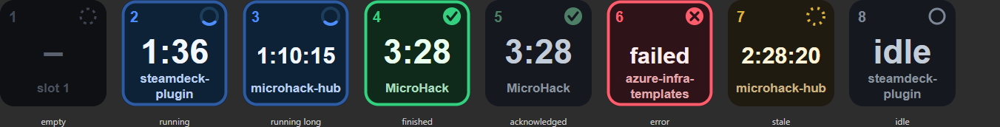

# Copilot Agents for Stream Deck

One Stream Deck key per running GitHub Copilot agent session in VS Code. Each key shows
whether that agent is working or done, and pressing it brings the right VS Code window to
the front, which is the part that gets painful once you have a dozen windows open.



## How it detects agent status

No VS Code extension is required. VS Code already journals every chat session to disk:

```
%APPDATA%\Code\User\workspaceStorage\<hash>\
  workspace.json                     -> { "folder": "file:///c%3A/node/my-project" }
  chatSessions\<sessionId>.jsonl     -> append-only patch journal, written live
```

The journal is a stream of patches where `kind:1` sets a value and `kind:2` appends to an
array:

| Record | Meaning |
| --- | --- |
| `{"kind":0,"v":{...}}` | Full snapshot, always the first line |
| `{"kind":2,"k":["requests"],"v":[{...}]}` | A turn **started** |
| `{"kind":2,"k":["requests",N,"response"],...}` | Streaming response parts |
| `{"kind":1,"k":["requests",N,"result"],...}` | Turn N **finished** |
| `{"kind":1,"k":["requests",N,"elapsedMs"],"v":1234}` | Turn N duration |

So a session is **running** when its newest turn index is ahead of the newest completed
turn index. `elapsedMs` is used as the completion marker rather than `result`, because
`result` embeds the rendered prompt and is often megabytes, while `elapsedMs` is a few
bytes, always follows it, and never appears on a live turn.

`workspace.json` maps each storage hash back to the folder that window has open, which is
how a session becomes "the agent in *my-project*".

### Keeping disk I/O low

These journals grow to tens of megabytes and sit in the exact directory VS Code is actively
writing, so naive tailing makes real-time antivirus rescan them constantly and slows Copilot
itself down. Three things keep the cost near zero:

- **Bounded seeding.** A newly tracked session is seeded from its last 128 KB, not from byte
  zero. Startup reads dropped from 22 MB to 1 MB on a real machine.
- **Persistent handles.** Each journal is opened once and kept open, instead of
  open/read/close on every poll. This is the big one: an open of a 6 MB file that changed a
  moment ago triggers a full AV rescan, and it was happening twice a second.
- **Directory watchers.** Every `chatSessions` directory is watched, so reads happen only when
  something actually changed. 177 watchers measured at 1.1 MB total (6.6 KB each) and 158 ms to
  attach. Watching the parent `<hash>` directories instead would be far noisier, because
  `state.vscdb` churns constantly.
- **Sweep demoted to reconciliation.** Directory scanning runs every 5 min purely as a safety
  net for dropped events, and a 5 s poll backstops tracked journals. A directory that cannot be
  watched falls back to a 30 s sweep automatically.

Together these take the steady state from ~55 to ~3 `stat`/s with no directory reads at all,
while *improving* detection latency from 500 ms to roughly 120 ms.
`npm run probe` prints the live I/O counters so you can check this yourself.

## How it focuses the right window

All VS Code windows share a single `Code.exe` process, so `Get-Process` cannot tell them
apart. The plugin keeps a long-lived PowerShell helper
([win-helper.ps1](com.marcoweber.copilot-agents.sdPlugin/scripts/win-helper.ps1)) that
P/Invokes `EnumWindows` to list every top-level window with its title, and
`AttachThreadInput` + `SetForegroundWindow` to raise one.

VS Code window titles end in `<file> - <rootName> - Visual Studio Code`, so the workspace
name is matched against `rootName`. When that is ambiguous (two open folders with the same
basename) or the helper is unavailable, it falls back to `code <absolute-path>`, which VS
Code resolves exactly and uses to raise the window already hosting that folder.

## Key states

| State | Look |
| --- | --- |
| Running | Blue, pulsing border, spinner, live elapsed time |
| Done | Green, checkmark, turn duration, stays lit until you press it |
| Acknowledged | Dimmed green, key stays bound to that window |
| Failed | Red cross |
| Stale | Amber dashed ring, for a turn that claims to run but went quiet for 5+ min |
| Idle / empty | Grey |

## Setup

```powershell
npm install
npm run build
npx streamdeck dev      # enable developer mode (once)
npm run link            # symlink into %APPDATA%\Elgato\StreamDeck\Plugins
npm run restart
```

Then drag **Agent Slot** onto as many keys as you want. Each key claims the next free slot
number automatically, so six keys give you slots 1 to 6.

### Per-key settings

- **Slot** — which agent this key tracks. Slots fill by most recent activity and stay
  bound to a session until its window closes, so keys do not reshuffle underneath you.
- **Workspace** — pin the key to one project instead, so it always represents the same
  window regardless of activity order.

## Development

```powershell
npm run watch      # rebuild + hot reload the plugin
npm run probe      # print live agent state and I/O counters, no Stream Deck needed
npm run test       # verify discovery against a throwaway fixture
npm run preview    # render every key state to .probe/preview.html
npm run validate   # validate the manifest
```

`npm run probe` is the fastest way to confirm detection works, since it prints the same
state the keys render:

```
running   turns= 6   0s ago  MicroHack          seeds, configpaths are an implementation detail
running   turns= 1  17s ago  steamdeck-plugin   i have a elgato stream deck and want to create
finished  turns=13  77s ago  microhack-hub      back to this example: (the outcome would now be
```

## Limitations

- Windows only. The detection logic is cross-platform, but window focusing is Win32.
- Pressing a key focuses the *window*, not the specific chat tab. VS Code exposes no way
  for an external process to select a chat session.
- Two open folders with the same basename fall back to the slower `code <path>` focus path.
- Journal format is an internal VS Code detail and may change between releases. If keys
  stop updating, run `npm run probe` to see what the journals now contain.
